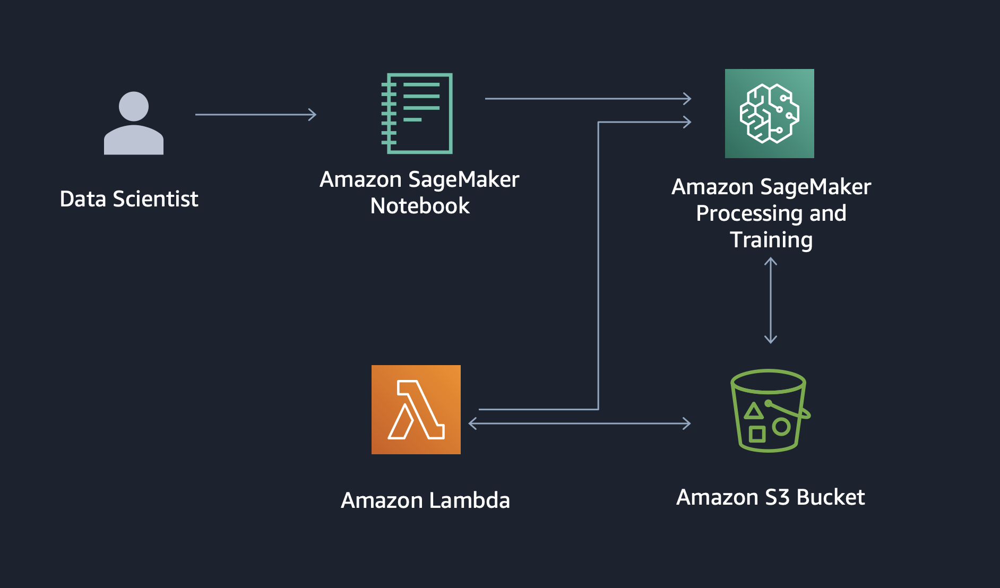

# Entity Resolution for Smart Advertising using Amazon SageMaker

This project shows how to use [Deep Graph Library (DGL)](https://www.dgl.ai/) on [Amazon SageMaker](https://aws.amazon.com/sagemaker/) to train a graph neural network (GNN) model to perform entity resolution on customer identity graphs. See the project detail page to learn more about the techniques used.

## Getting Started

To get started quickly, use the following quick-launch link to create a CloudFormation stack and deploy the resources in this project.

| Region | Stack |
| ---- | ---- |
|US West (Oregon) |   |
|US East (N. Virginia) |   |
|US East (Ohio) |   |

On the stack creation page, check the boxes to acknowledge creation of IAM resources and auto-expand, and click **Create Stack**.

Once the stack is created, go to the Outputs tab and click on the SageMakerNotebook link. This will open up the jupyter notebook in a SageMaker Notebook instance where you can run the code in the notebook.

## Architecture
The project architecture deployed by the cloud formation template is shown here.

## Contents

* `deployment/`
  * `sagemaker-graph-entity-resolution.yaml`: Creates AWS CloudFormation Stack for solution
* `source/`
  * `lambda/`
    * `data-preprocessing/`
      * `index.py`: Lambda function script for invoking SageMaker processing
    * `graph-modelling/` 
      * `index.py`: Lambda function script for invoking SageMaker training
  * `sagemaker/`
    * `data-preprocessing/`
      * `data_preparation_script.py`: Custom script used to prepare CIKM cup data to solution input format
      * `data_preprocessing_script.py`: Custom script used by SageMaker Processing for data processing/feature engineering
    * `dgl-entity-resolution/`
      * `model.py`: Implements the various graph neural network models used in the project with the pytorch backend
      * `data.py`: Contains functions for reading edges and node features
      * `estimator_fns.py`: Contains functions for parsing input from SageMaker estimator objects
      * `graph.py`: Contains functions for constructing DGL Graphs with node features and edge lists
      * `requirements.txt`: Describes Python package requirements of the Amazon SageMaker training instance
      * `sampler.py`: Contains functions for graph sampling for mini-batch training
      * `train_dgl_pytorch_entry_point.py`: python entry point used by the notebook for GNN training with DGL pytorch backend
      * `utils.py`: python script with utility functions for computing metrics and plots
    * `dgl-entity-resolution.ipynb`: Orchestrates the solution. Triggers preprocessing and model training

## License

This project is licensed under the Apache-2.0 License.

